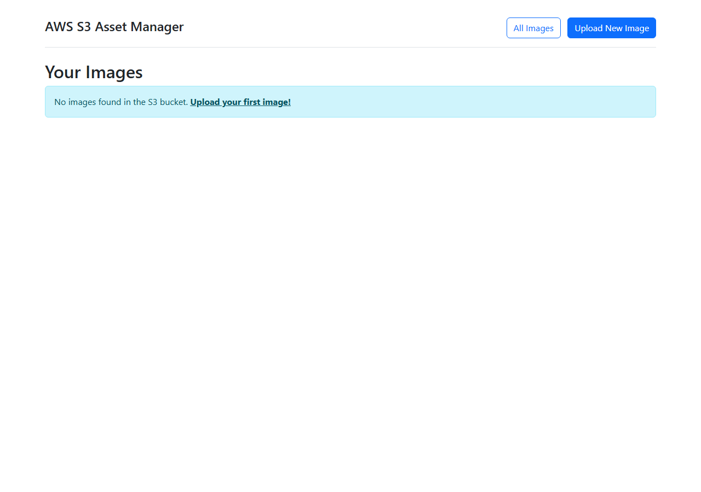
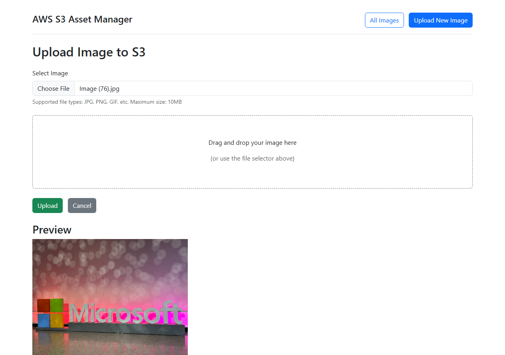
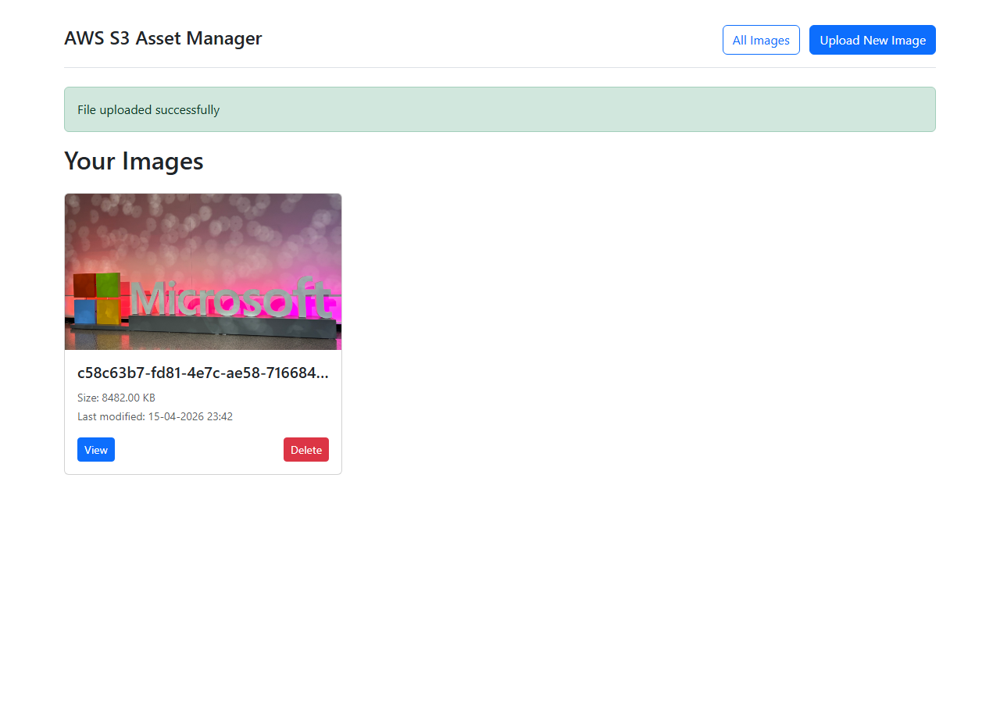
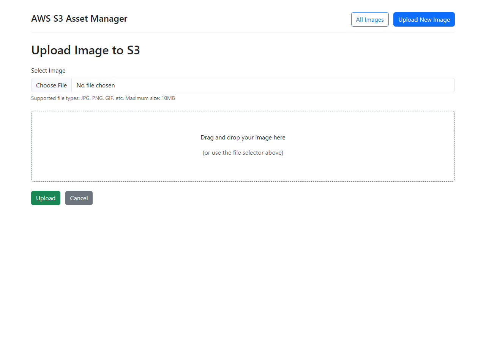

## Overview

This lab walks you through modernizing a **Java 8 Spring Boot 2.7** application—the **Assets Manager**—from AWS to Azure. Using the **Spec2Cloud** methodology and GitHub Copilot, you will upgrade the application to Java 21 and Spring Boot 3.x, replacing AWS services (S3, SQS) with their Azure counterparts (Blob Storage, Service Bus) while migrating the database to Azure Database for PostgreSQL. The goal is a fully cloud-native Azure deployment driven by specification documents rather than manual refactoring.

## The Legacy Application

The Assets Manager is a multi-module Spring Boot web application that allows users to upload, browse, and manage image assets. It stores files in S3-compatible object storage, tracks metadata in PostgreSQL, and uses a message queue for asynchronous processing.

The home page presents a storage listing view where users can see all uploaded assets at a glance:

The core workflow revolves around file management. Users select an image file through the upload form, which supports JPG, PNG, and GIF formats up to 10 MB:

After a successful upload, the asset appears in the gallery with its metadata (file size, timestamp) and actions for viewing or deleting:

This legacy version runs on Java 8 with AWS SDK dependencies and Docker-based local services (MinIO for S3, RabbitMQ, PostgreSQL). The modernization process will replace all of these with Azure-native equivalents.

## Initial Application Screenshots

The following screenshots show the **legacy Java 8 / Spring Boot 2.7 / AWS** version of the Assets Manager application before modernization. The app was run locally using Docker containers for PostgreSQL, RabbitMQ, and MinIO (S3-compatible storage).

> **Note:** The original `AwsS3Config.java` in the web module was missing a `@Bean` annotation on the `s3Client()` method, which prevented the application from starting. This was temporarily patched during testing — it is a known issue in the legacy codebase that modernization should address.

### Storage Listing (Home Page)
Empty state — no images uploaded yet.

### Upload Page
Form for uploading images to S3 storage (supports JPG, PNG, GIF up to 10 MB).

### Upload With File Selected
A sample image selected and previewed before upload.

### After Successful Upload
Image uploaded successfully and displayed in the gallery with metadata (size, timestamp) and View/Delete actions.

## Solution Branch

The completed modernization is available on the `solution-final` branch with step-by-step tags:

| Step | Tag | Description |
|------|-----|-------------|
| 01 | `step-01-explore-legacy` | Explore legacy Java 8 application, analyze codebase |
| 02 | `step-02-spec2cloud-analysis` | Spec2Cloud analysis of migration candidates |
| 03 | `step-03-migration-spec` | Generate comprehensive migration specification |
| 04 | `step-04-update-java` | Update Java version from 8 to 21 in POMs |
| 05 | `step-05-migrate-springboot` | Migrate Spring Boot 2.7 → 3.4 (jakarta namespace) |
| 06 | `step-06-modernize-code` | Apply Java 21 features (records, sealed, var, switch expressions, virtual threads) |
| 07 | `step-07-migrate-cloud` | Migrate AWS S3/RabbitMQ → Azure Blob Storage/Service Bus |
| 08 | `step-08-build-test` | Full build and test verification |

### Key Modernization Changes
- **Java**: 8 → 21 (records, sealed interfaces, var, switch expressions, pattern matching, virtual threads)
- **Spring Boot**: 2.7.18 → 3.4.1 (jakarta namespace, modern interfaces)
- **Storage**: AWS S3 SDK → Azure Blob Storage SDK (12.29.1)
- **Messaging**: RabbitMQ/AMQP → Azure Service Bus SDK (7.17.8)
- **Database**: PostgreSQL (unchanged)
- **Tests**: 4/4 passing