```
 █████╗ ███████╗███████╗███████╗████████╗███████╗
██╔══██╗██╔════╝██╔════╝██╔════╝╚══██╔══╝██╔════╝
███████║███████╗███████╗█████╗     ██║   ███████╗
██╔══██║╚════██║╚════██║██╔══╝     ██║   ╚════██║
██║  ██║███████║███████║███████╗   ██║   ███████║
╚═╝  ╚═╝╚══════╝╚══════╝╚══════╝   ╚═╝   ╚══════╝
███╗   ███╗ █████╗ ███╗   ██╗ █████╗  ██████╗ ███████╗██████╗
████╗ ████║██╔══██╗████╗  ██║██╔══██╗██╔════╝ ██╔════╝██╔══██╗
██╔████╔██║███████║██╔██╗ ██║███████║██║  ███╗█████╗  ██████╔╝
██║╚██╔╝██║██╔══██║██║╚██╗██║██╔══██║██║   ██║██╔══╝  ██╔══██╗
██║ ╚═╝ ██║██║  ██║██║ ╚████║██║  ██║╚██████╔╝███████╗██║  ██║
╚═╝     ╚═╝╚═╝  ╚═╝╚═╝  ╚═══╝╚═╝  ╚═╝ ╚═════╝ ╚══════╝╚═╝  ╚═╝
███████╗██████╗ ███████╗ ██████╗██████╗  ██████╗██╗      ██████╗ ██╗   ██╗██████╗
██╔════╝██╔══██╗██╔════╝██╔════╝╚════██╗██╔════╝██║     ██╔═══██╗██║   ██║██╔══██╗
███████╗██████╔╝█████╗  ██║      █████╔╝██║     ██║     ██║   ██║██║   ██║██║  ██║
╚════██║██╔═══╝ ██╔══╝  ██║     ██╔═══╝ ██║     ██║     ██║   ██║██║   ██║██║  ██║
███████║██║     ███████╗╚██████╗███████╗╚██████╗███████╗╚██████╔╝╚██████╔╝██████╔╝
╚══════╝╚═╝     ╚══════╝ ╚═════╝╚══════╝ ╚═════╝╚══════╝ ╚═════╝  ╚═════╝ ╚═════╝
```

<div align="center">

### 🚀 **Java 8 → Java 21 & AWS → Azure Modernization with Spec2Cloud** 🚀

*Learn how to modernize a legacy Java application using **Spec-Driven Development** and the **Spec2Cloud** framework, powered by **GitHub Copilot** 🤖*

---

[](https://openjdk.org/)
[](https://spring.io/projects/spring-boot)
[](https://github.com/features/copilot)
[](https://azure.microsoft.com/)
[](https://github.com/EmeaAppGbb/spec2cloud)

</div>

---

## 📖 Table of Contents

- [🎯 About This Lab](#-about-this-lab)
- [💡 What is Spec2Cloud?](#-what-is-spec2cloud)
- [💡 What is Spec-Driven Development?](#-what-is-spec-driven-development)
- [📦 The Assets Manager App](#-the-assets-manager-app)
- [📂 Repository Structure](#-repository-structure)
- [✅ Prerequisites](#-prerequisites)
- [🛠️ Modernization Steps](#️-modernization-steps)
  - [Step 1 — Initialize Spec2Cloud](#-step-1--initialize-spec2cloud)
  - [Step 2 — Launch GitHub Copilot](#-step-2--launch-github-copilot)
  - [Step 3 — Run Modernization Assessment](#-step-3--run-modernization-assessment)
  - [Step 4 — Review the Assessment](#-step-4--review-the-assessment)
  - [Step 5 — Generate the Modernization Plan](#-step-5--generate-the-modernization-plan)
  - [Step 6 — Move from AWS to Azure](#-step-6--move-from-aws-to-azure)
  - [Step 7 — Review & Approve the Plan](#-step-7--review--approve-the-plan)
  - [Step 8 — Execute the Modernization](#-step-8--execute-the-modernization)
  - [Step 9 — Modernization Complete! 🎉](#-step-9--modernization-complete-)
  - [Step 10 — Document Architecture](#-step-10--document-architecture)
  - [Step 11 — Generate Tests](#-step-11--generate-tests)
  - [Step 12 — CVEs & Security Analysis](#-step-12--cves--security-analysis)
  - [Step 13 — Evolve with a New Feature](#-step-13--evolve-with-a-new-feature)
- [🌿 Branches & Tags](#-branches--tags)
- [📚 Additional Resources](#-additional-resources)

---

## 🎯 About This Lab

This is a **hands-on lab repository** designed to teach you how to modernize a legacy **Java 8** application running on **AWS** into a modern **Java 21** application targeting **Azure** using:

| Concept | Description |
|---------|-------------|
| 📝 **Spec-Driven Development** | A methodology where specifications drive the entire modernization lifecycle |
| ☁️ **Spec2Cloud Framework** | An AI-powered framework that translates specs into cloud-ready code |
| 🤖 **GitHub Copilot** | Your AI pair-programmer that orchestrates the modernization process |
| ☁️ **Azure** | The target cloud platform for the modernized application (replacing AWS) |

> 💡 **Who is this for?** Developers, architects, and anyone interested in learning a structured, AI-assisted approach to Java application modernization and cloud migration.

---

## 💡 What is Spec2Cloud?

> 📖 **Full documentation:** [Spec2Cloud on GitHub](https://github.com/EmeaAppGbb/spec2cloud) | [Brownfield Guide](https://github.com/EmeaAppGbb/spec2cloud/blob/vNext/docs/brownfield.md)

**Spec2Cloud** is a framework that bridges the gap between **application specifications** and **cloud-ready implementations**. It uses AI-powered agents and GitHub Copilot skills to:

1. 🔍 **Assess** — Analyze your legacy codebase and generate comprehensive assessment documents
2. 📋 **Plan** — Create a detailed, step-by-step modernization plan based on the assessment
3. ⚙️ **Execute** — Automatically implement the modernization changes following the plan
4. ✅ **Validate** — Ensure the modernized application meets the original specifications

```
┌──────────────┐     ┌──────────────┐     ┌──────────────┐     ┌──────────────┐
│  📝 ASSESS   │ ──▶ │  📋 PLAN     │ ──▶ │  ⚙️ EXECUTE  │ ──▶ │  ✅ VALIDATE │
│              │     │              │     │              │     │              │
│ Analyze code │     │ Generate     │     │ Implement    │     │ Test & verify│
│ Generate FRD │     │ modernization│     │ changes      │     │ specs met    │
│ Generate PRD │     │ roadmap      │     │ iteratively  │     │              │
└──────────────┘     └──────────────┘     └──────────────┘     └──────────────┘
```

---

## 💡 What is Spec-Driven Development?

**Spec-Driven Development (SDD)** is a methodology where **specifications are the single source of truth** throughout the software lifecycle. Unlike traditional approaches where specs become outdated quickly, SDD ensures:

- 📄 **Specs are living documents** — They evolve with the code and are always up to date
- 🔗 **Traceability** — Every code change maps back to a specification requirement
- 🤖 **AI-Assisted** — GitHub Copilot uses specs as context to generate accurate, aligned code
- 🔄 **Iterative** — Specs and code evolve together through continuous feedback loops

---

## 📦 The Assets Manager App

The **Assets Manager** is a multi-module Spring Boot application for managing image assets — uploading, viewing, downloading, and generating thumbnails. It's the perfect candidate for both **Java version modernization** and **cloud migration**! 🖼️

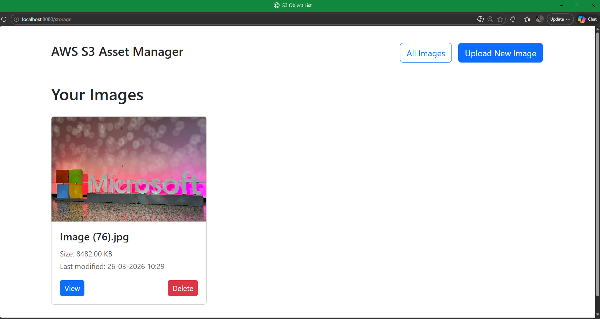

### 🔧 Current Tech Stack (Legacy)

| Component | Technology |
|-----------|-----------|
| ☕ **Language** | Java 8 |
| 🌱 **Framework** | Spring Boot 2.7.18 |
| ☁️ **Object Storage** | AWS S3 (SDK v2.25.13) |
| 📨 **Message Queue** | RabbitMQ (via Spring AMQP) |
| 🗃️ **Database** | PostgreSQL (via Spring Data JPA) |
| 🎨 **Templating** | Thymeleaf |
| 🔧 **Build Tool** | Maven (with Maven Wrapper) |
| 📦 **Utilities** | Lombok, Jackson |

### ✨ Application Features

- 📤 **Image Upload** — Upload images to S3 storage with metadata tracking
- 📋 **Image Listing** — Browse all uploaded images with metadata
- 👁️ **Image Viewing** — View images and their thumbnails in the browser
- 📥 **Image Download** — Download original files
- 🗑️ **Image Deletion** — Remove images and associated thumbnails
- 🖼️ **Thumbnail Generation** — Asynchronous thumbnail creation via a worker process and RabbitMQ
- 💾 **Local Dev Mode** — Profile-based local file storage for development

### 🏗️ Architecture Overview

The application follows a **multi-module architecture** with two Spring Boot services communicating via RabbitMQ:

```
┌──────────────────┐        ┌─────────────┐        ┌──────────────────┐
│   🌐 Web Module  │──────▶│  🐰 RabbitMQ │──────▶│  ⚙️ Worker Module │
│                  │        │             │        │                  │
│ • Upload images  │        │ Message     │        │ • Generate       │
│ • List/View/     │        │ Queue       │        │   thumbnails     │
│   Delete images  │        │             │        │ • Store back     │
│ • Serve UI       │        └─────────────┘        │   to S3          │
│   (Thymeleaf)    │                               └──────────────────┘
│                  │                                        │
│        │         │                                        │
│        ▼         │                                        ▼
│  ┌───────────┐   │                                ┌───────────┐
│  │🗃️ PostgreSQL│  │                                │ ☁️ AWS S3  │
│  └───────────┘   │                                └───────────┘
└──────────────────┘
```

### 📁 Module Structure

```
assets-manager-parent/
├── 📂 web/                          # 🌐 Web Module (Spring Boot app)
│   ├── 📂 src/main/java/.../assets/
│   │   ├── AssetsManagerApplication.java    # Application entry point
│   │   ├── 📂 config/              # ⚙️ Configuration classes
│   │   │   ├── AwsS3Config.java             # AWS S3 client setup
│   │   │   ├── RabbitConfig.java            # RabbitMQ queue config
│   │   │   └── WebMvcConfig.java            # Spring MVC config
│   │   ├── 📂 constants/           # 📌 Application constants
│   │   │   └── StorageConstants.java
│   │   ├── 📂 controller/          # 🎮 REST/MVC Controllers
│   │   │   ├── HomeController.java
│   │   │   └── S3Controller.java
│   │   ├── 📂 model/               # 📦 Data models
│   │   │   ├── ImageMetadata.java           # JPA entity
│   │   │   ├── ImageProcessingMessage.java  # RabbitMQ message DTO
│   │   │   └── S3StorageItem.java           # Storage item model
│   │   ├── 📂 repository/          # 🗄️ Data access layer
│   │   │   └── ImageMetadataRepository.java
│   │   └── 📂 service/             # ⚙️ Business logic
│   │       ├── StorageService.java          # Storage interface
│   │       ├── AwsS3Service.java            # AWS S3 implementation
│   │       ├── LocalFileStorageService.java # Local dev implementation
│   │       └── BackupMessageProcessor.java
│   └── 📂 src/main/resources/
│       ├── application.properties           # App configuration
│       └── 📂 templates/           # 🎨 Thymeleaf templates
│           ├── layout.html
│           ├── list.html
│           ├── upload.html
│           └── view.html
├── 📂 worker/                       # ⚙️ Worker Module (Spring Boot app)
│   └── 📂 src/main/java/.../worker/
│       ├── WorkerApplication.java           # Worker entry point
│       ├── 📂 config/              # RabbitMQ & S3 configuration
│       ├── 📂 model/               # Shared message models
│       ├── 📂 repository/          # Data access layer
│       ├── 📂 service/             # Thumbnail processing service
│       └── 📂 util/                # Image utility classes
├── 📂 storage/                      # 📁 Local storage (dev profile)
└── 📄 pom.xml                       # Parent POM (Java 8 config)
```

### 🎯 Modernization Targets

This lab covers **two major modernization goals**:

| Goal | From | To |
|------|------|----|
| ☕ **Java Version Upgrade** | Java 8 | Java 21 |
| 🌱 **Framework Upgrade** | Spring Boot 2.7 | Spring Boot 3.x |
| ☁️ **Cloud Migration** | AWS S3 | Azure Blob Storage |
| 📨 **Message Queue Migration** | RabbitMQ (self-hosted) | Azure Service Bus |
| 🗃️ **Database Migration** | PostgreSQL (self-hosted) | Azure Database for PostgreSQL |
| 📦 **Dependency Modernization** | javax.* namespace | jakarta.* namespace |

---

## 📂 Repository Structure

```
📦 AppModLab-java-8to21-AssetsManager-spec2cloud
├── 📄 README.md              # 👈 You are here!
├── 📄 pom.xml                # 🔧 Parent Maven POM (Java 8)
├── 📄 mvnw / mvnw.cmd        # 🔧 Maven Wrapper scripts
├── 📂 img/                   # 🖼️ Screenshots and diagrams for this guide
├── 📂 storage/               # 📁 Local file storage (dev profile)
├── 📂 web/                   # 🌐 Web module — Spring Boot web app
├── 📂 worker/                # ⚙️ Worker module — thumbnail generator
└── 📂 wrapper/               # 🔧 Maven Wrapper configuration
```

### 🌿 Branches & Tags

| Branch | Description |
|--------|-------------|
| 🟢 `main` | The **starting point** — contains the legacy Java 8 + AWS codebase |
| 🏁 `final-solution` | The **finished result** — contains the fully modernized Java 21 + Azure application |

> 💡 **Pro Tip:** Each modernization step is **tagged** in the `final-solution` branch! You can compare your progress at any point, or jump ahead to study the approach and results without going through the entire process. 🔖

---

## ✅ Prerequisites

Before starting this lab, make sure you have the following installed:

| Requirement | Purpose |
|-------------|---------|
| 🖥️ **VS Code** | IDE for development |
| ☕ **Java 8 JDK** | To build and run the legacy app |
| ☕ **Java 21 JDK** | Target JDK for modernization |
| 🔧 **Maven 3.9+** *(or use included wrapper)* | Build tool |
| 🗃️ **PostgreSQL** | Database engine |
| 🐰 **RabbitMQ** | Message queue for the legacy stack |
| 📦 **Node.js & npm** | Required to run `npx spec2cloud` |
| 🤖 **GitHub Copilot** | AI assistant (requires active subscription) |
| ☁️ **Azure Subscription** *(optional)* | For deploying to Azure |

---

## 🛠️ Modernization Steps

Follow these steps to modernize the Assets Manager application from Java 8 to Java 21 and migrate from AWS to Azure using Spec2Cloud! 🚀

---

### 📌 Step 1 — Initialize Spec2Cloud

Open a terminal in the repository root and run:

```bash
npx spec2cloud init
```

You will be prompted to select the setup scope. Choose **🏗️ Brownfield** since we are modernizing an existing application.


> 📖 **Need more details?** Check out the full [Spec2Cloud Brownfield Documentation](https://github.com/EmeaAppGbb/spec2cloud/blob/vNext/docs/brownfield.md) for an in-depth guide on brownfield modernization scenarios.

> ℹ️ **What happens here?** Spec2Cloud scaffolds the necessary configuration files and Copilot skills into your repository, preparing it for the spec-driven modernization workflow.

---

### 📌 Step 2 — Launch GitHub Copilot

Start GitHub Copilot in your terminal:

```bash
copilot
```

> 💡 **Optional:** Use the `--yolo` flag for a smoother lab experience — this reduces the number of confirmation prompts so you can focus on the process:
>
> ```bash
> copilot --yolo
> ```

---

### 📌 Step 3 — Run Modernization Assessment

Use the **Modernization-Assessment** Spec2Cloud skill in Copilot:

```
/modernization-assessment
```

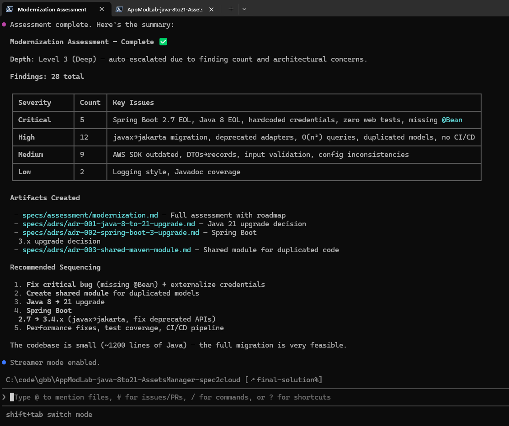

Then, ask Copilot to **analyze the codebase** and generate the application architecture, Functional Requirements Documents (FRDs), and Product Requirements Documents (PRDs):

```
Analyse the codebase and generate specs
```

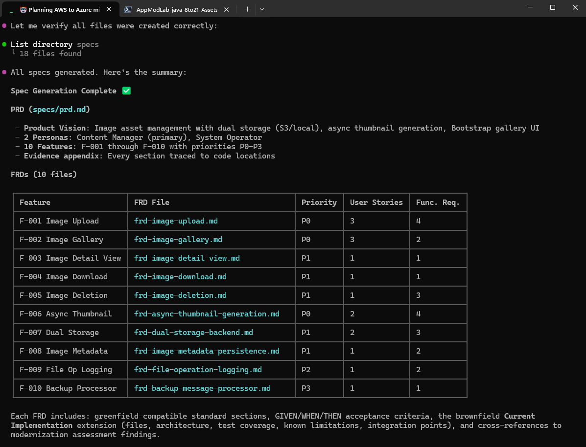

🎁 **What you get:** A rich set of documentation to help you deeply understand the application and its modernization needs! Copilot can also generate diagrams and architecture documentation based on the code analysis.

---

### 📌 Step 4 — Review the Assessment

📖 **Read the output assessment documents** carefully and understand the modernization approach proposed for this application.

Key things to look for:
- 🔍 Identified dependencies and breaking changes (e.g., `javax.*` → `jakarta.*`)
- 📋 Proposed target framework and platform (Spring Boot 3.x on Azure)
- ⚠️ Risk areas and mitigation strategies (AWS SDK removal, S3 → Blob Storage)
- 📊 Effort estimation

> 🔧 **Customization:** You can tell Copilot to adjust the assessment based on your specific intent and requirements!

For this lab, we will proceed with the proposed modernization to **Java 21** and migration from **AWS to Azure** ☁️

---

### 📌 Step 5 — Generate the Modernization Plan

Ask Copilot to generate a detailed modernization plan using the **Modernization Planning** Spec2Cloud skill:

```
/modernization-planner
```

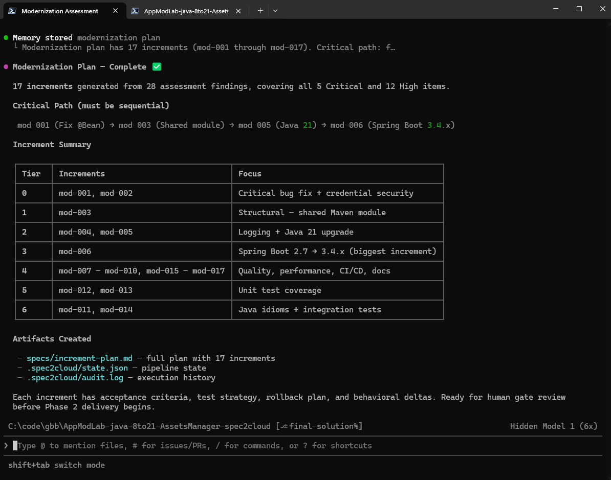

> 📋 **What you get:** A comprehensive, step-by-step implementation plan that breaks down the modernization into manageable, ordered tasks.

---

### 📌 Step 6 — Move from AWS to Azure

Ask Copilot to include the cloud migration in the modernization plan:

```
include in the modernization plan a move from AWS to Azure
```

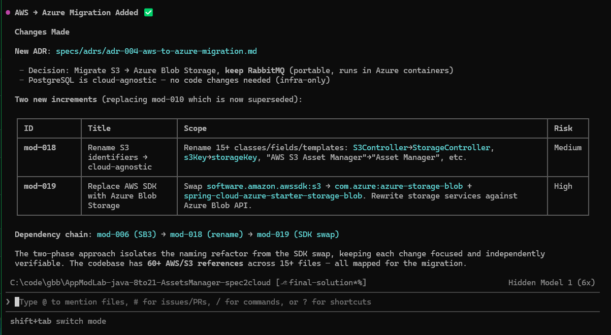

This step ensures the plan covers:
- ☁️ **AWS S3 → Azure Blob Storage** — Replace the AWS S3 SDK with the Azure Storage SDK
- 📨 **RabbitMQ → Azure Service Bus** — Migrate message queue to a managed Azure service
- 🗃️ **PostgreSQL → Azure Database for PostgreSQL** — Move to a managed database service
- 🔧 **Configuration updates** — Update properties files for Azure service endpoints

---

### 📌 Step 7 — Review & Approve the Plan

📖 **Read the modernization plan** thoroughly and understand each step that will be taken to modernize the application.

- ✏️ You can ask Copilot to **modify the plan** based on your needs
- ✅ You will need to **give your consent** before Copilot begins executing the plan
- 🔄 The plan is iterative — you maintain full control at every stage

---

### 📌 Step 8 — Execute the Modernization

Once approved, the modernization process begins! 🏗️

Copilot will **iterate through each step** of the modernization plan and execute the changes automatically. You can:

- 👀 **Monitor progress** in the terminal output
- 📄 **Review generated documentation** as changes are made
- 🛑 **Pause or intervene** at any point if needed

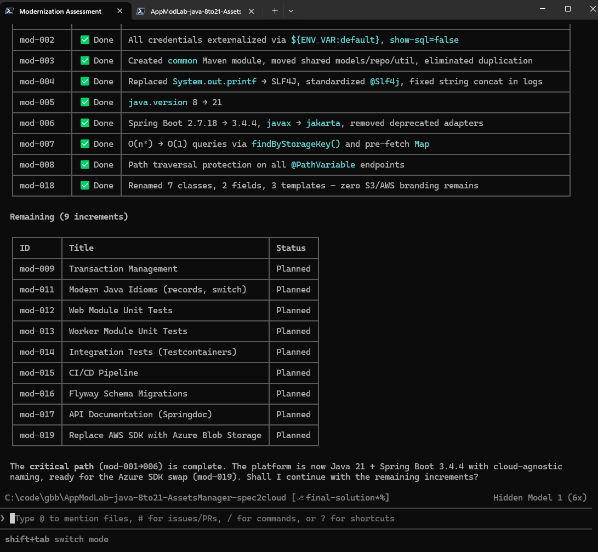

---

### 📌 Step 9 — Modernization Complete! 🎉

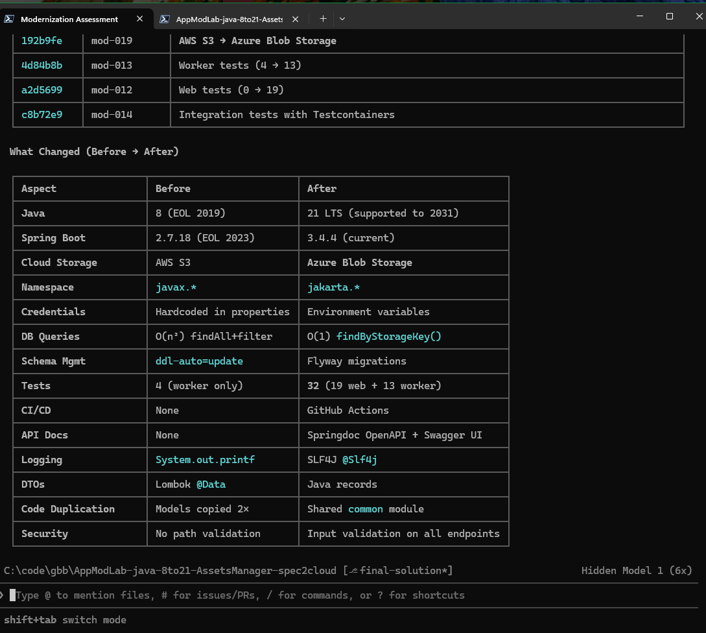

🥳 **Congratulations!** Once the modernization process is completed, you will have:

| Outcome | Details |
|---------|---------|
| ✅ **Modernized Application** | Running on Java 21 with Spring Boot 3.x and modern patterns |
| ☁️ **Cloud-Migrated** | AWS S3/RabbitMQ replaced with Azure Blob Storage/Service Bus |
| 📦 **Updated Dependencies** | `javax.*` → `jakarta.*`, latest Spring Boot 3.x libraries |
| 📚 **Full Documentation** | Detailed record of every change and decision |
| 🔍 **Traceability** | Every change mapped back to original specifications |

> 🚀 **But we're not done yet!** The following steps demonstrate how Spec2Cloud goes beyond modernization — helping you document, test, secure, and evolve your application.

---

### 📌 Step 10 — Document Architecture

🏛️ Continue to explore the power of Spec2Cloud by asking Copilot to generate architecture documentation for the modernized application. Leverage the **Architecture Mapper** skill to document your new version of the application:

```
/architecture-mapper based on the modernized code document all the architecture component
```

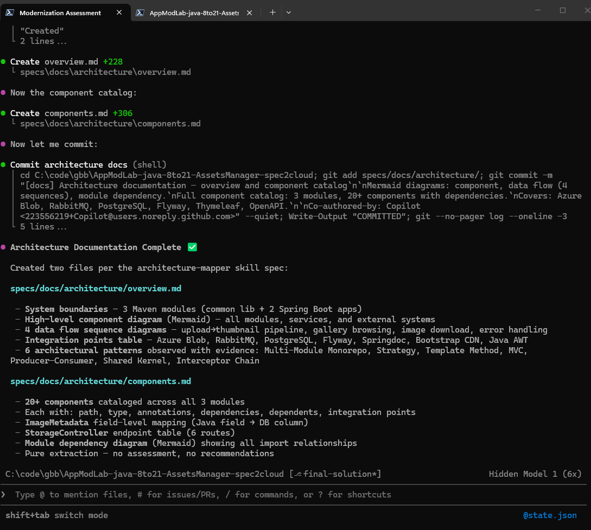

🎁 **What you get:** A detailed architecture documentation for your modernized application, including diagrams and component descriptions. This documentation will be invaluable for onboarding new team members and maintaining the application in the future.

---

### 📌 Step 11 — Generate Tests

🧪 Use the **Test Generation** skill to automatically create a comprehensive test suite for your modernized application:

```
/test-generation based on this new application generate all the tests for this application
```

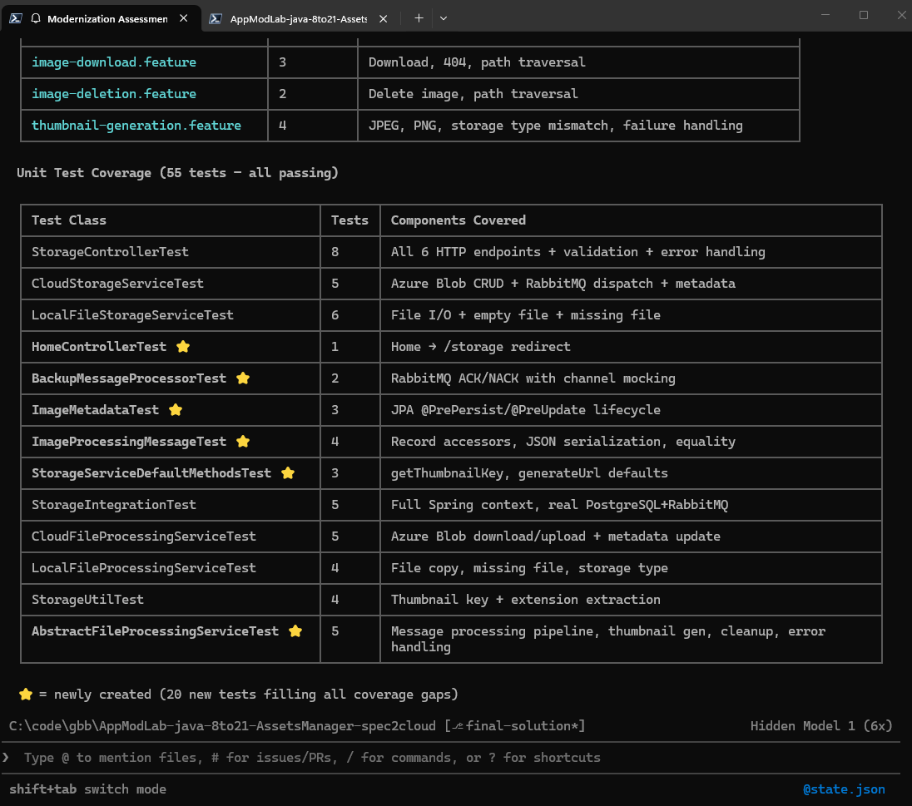

> ✅ **What you get:** A full set of unit and integration tests aligned with your application's specifications, ensuring your modernized code is robust and regression-proof.

---

### 📌 Step 12 — CVEs & Security Analysis

🔐 Use the **Security Assessment** skill to perform a full audit for security vulnerabilities and CVEs on your modernized application:

```
/security-assessment with this new modernized application perform a audit for security vulnerabilities and CVEs
```

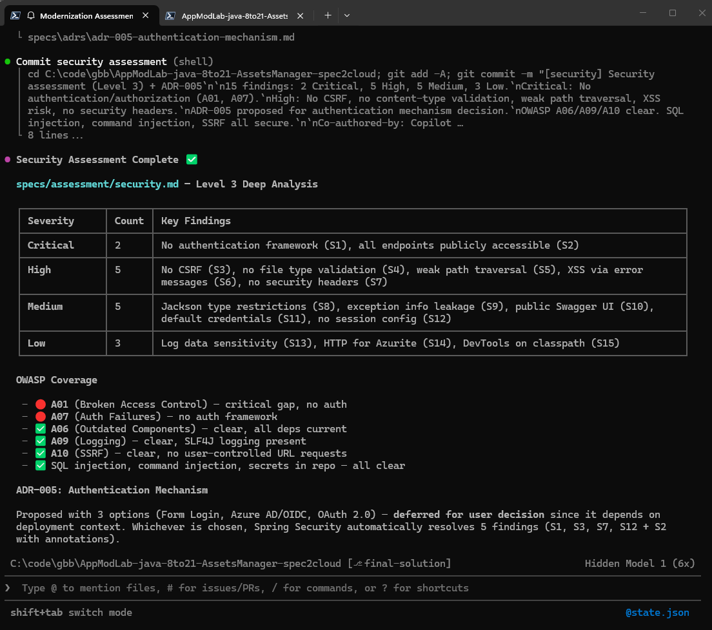

You will see a clear issue here about authentication — you will need to decide how to fix it. You can ask Copilot to suggest remediation for this issue (for this lab we will use form login with local database just to make it easier, but you can choose any other authentication method you want and ask Copilot to implement it for you):

```
for the authentication in the app use local database with Form Login
```

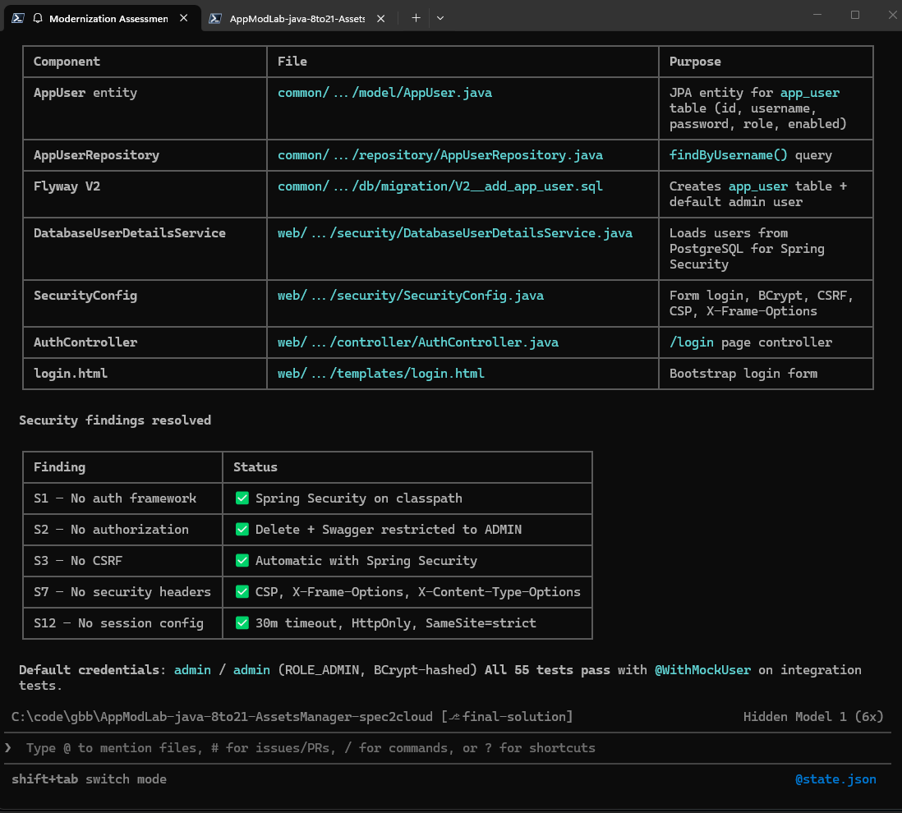

Next, plan the remediation of the identified security issues with the **Security Planner** skill:

```
/security-planner
```

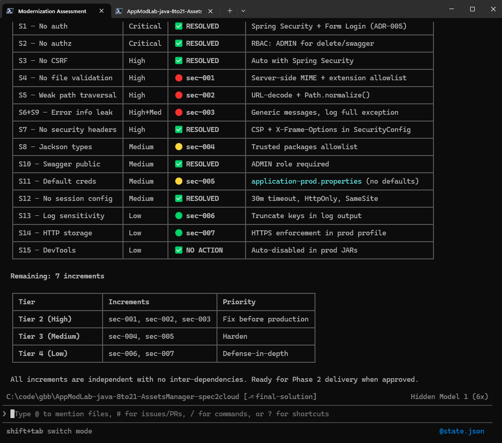

Finally, execute the security remediation plan:

```
implement the security remediation plan
```

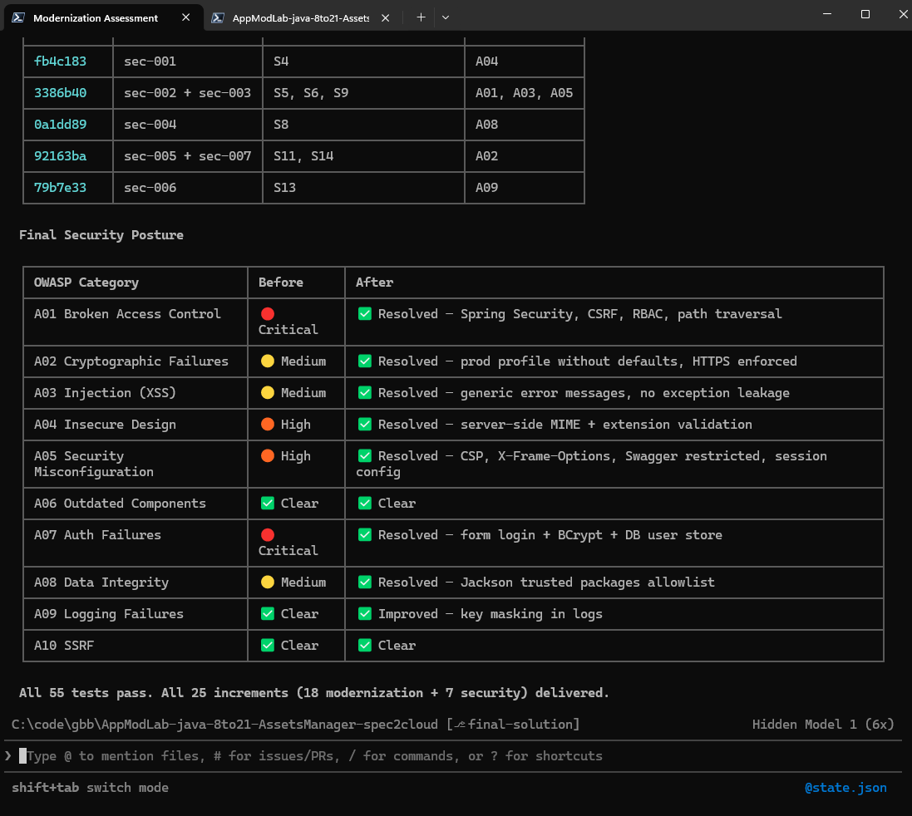

> 🛡️ **What you get:** A security-hardened application with identified CVEs remediated and documented.

---

### 📌 Step 13 — Evolve with a New Feature

🌱 Now that you have a modernized application, you can continue to evolve it using the **Spec-Driven Development** approach. Specify a new feature in the specifications and ask Copilot to implement it — ensuring your application continues to meet evolving user needs while maintaining a clear link between specifications and implementation.

Try it out for yourself! For example, you could specify a new feature like **"Folder/Album Organization — Allow users to create folders or albums to organize images."** or another feature of your choice.

**1️⃣ Add the new requirement to the specifications:**

```
Add the following requirement to the specifications: "Folder/Album Organization — Allow users to create folders or albums to organize images."
```

Review the updated specifications to ensure that the new requirement has been properly incorporated.

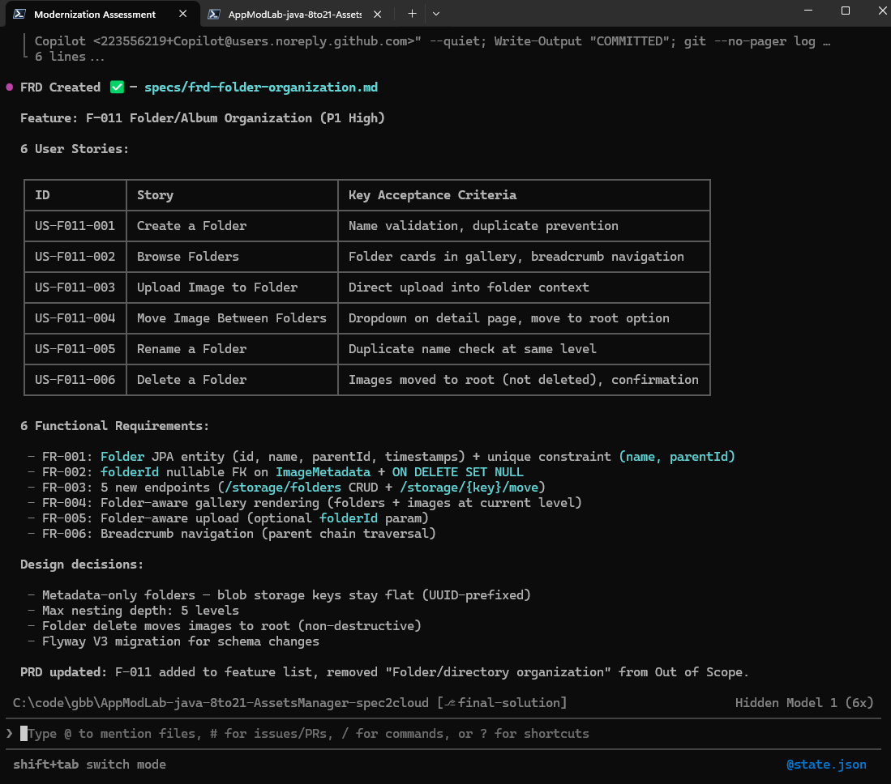

**2️⃣ Implement the new feature based on the updated specifications:**

```
Implement the new Folder/Album Organization functionality based on the updated specifications.
```

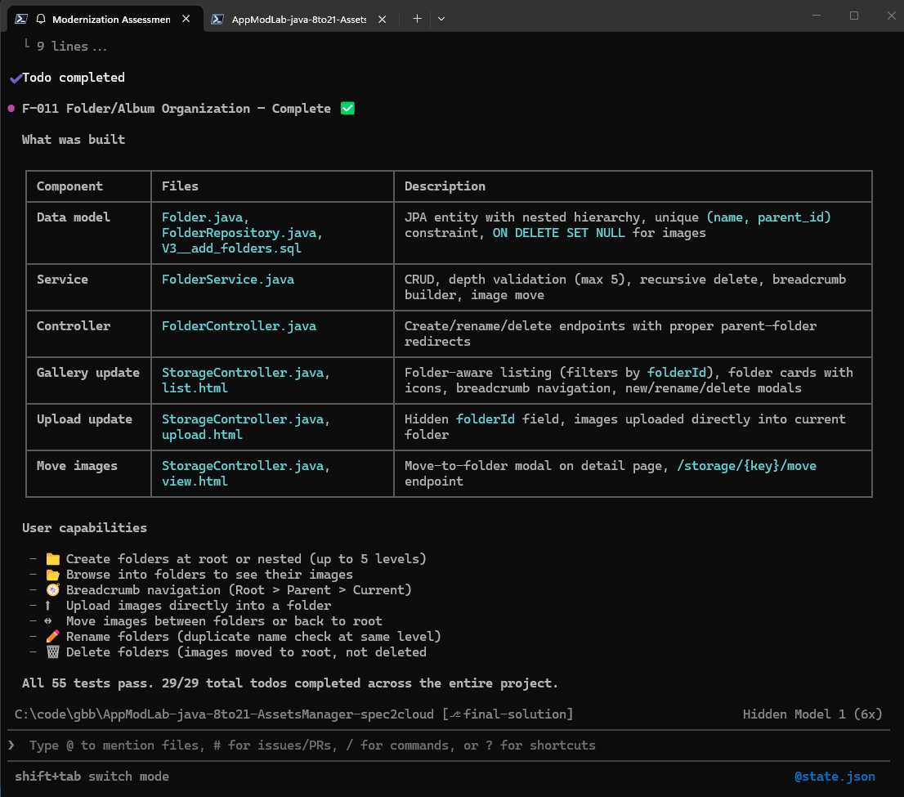

> 🎁 **What you get:** Copilot generates the necessary code changes to implement the Folder/Album Organization functionality, ensuring it aligns with the specifications and integrates seamlessly with the existing application.

---

### 🏆 Celebrate Your Modernized Application! 🎉

🥳 You have successfully modernized the Assets Manager application from Java 8 to Java 21 and migrated from AWS to Azure using Spec2Cloud and GitHub Copilot! Your application is now running on a modern tech stack — documented, tested, secured, and ready for future enhancements and cloud deployment.

```
  ☕ Before                           ☕ After
┌─────────────────────┐         ┌─────────────────────┐
│  Java 8             │         │  Java 21            │
│  Spring Boot 2.7    │  ════▶  │  Spring Boot 3.x    │
│  AWS S3             │         │  Azure Blob Storage  │
│  RabbitMQ           │         │  Azure Service Bus   │
│  PostgreSQL (local) │         │  Azure PostgreSQL    │
│  javax.* namespace  │         │  jakarta.* namespace │
└─────────────────────┘         └─────────────────────┘
```

---

## 📚 Additional Resources

| Resource | Link |
|----------|------|
| 📘 Spec2Cloud Repository | [github.com/EmeaAppGbb/spec2cloud](https://github.com/EmeaAppGbb/spec2cloud) |
| 📗 Spec2Cloud Brownfield Guide | [Brownfield Modernization Docs](https://github.com/EmeaAppGbb/spec2cloud/blob/vNext/docs/brownfield.md) |
| 🤖 GitHub Copilot Docs | [docs.github.com/copilot](https://docs.github.com/copilot) |
| ☕ Java 21 Migration Guide | [dev.java](https://dev.java/learn/migration/) |
| 🌱 Spring Boot 3 Migration Guide | [spring.io](https://spring.io/blog/2022/05/24/preparing-for-spring-boot-3-0) |
| ☁️ Azure for Java Developers | [learn.microsoft.com](https://learn.microsoft.com/en-us/azure/developer/java/) |
| ☁️ Azure Blob Storage SDK for Java | [learn.microsoft.com](https://learn.microsoft.com/en-us/azure/storage/blobs/storage-quickstart-blobs-java) |

---

<div align="center">

**💜 Built with love using Spec2Cloud & GitHub Copilot 🤖**

*If you found this lab useful, give it a ⭐ and share it with your team!*

</div>