# Component Catalog — Assets Manager

_Extracted on 2026-03-27._

## Module: common (assets-manager-common)

- **Path:** `common/`
- **Type:** Shared library (JAR — not independently runnable)
- **Responsibilities:** Houses domain models, JPA repository, utilities, and Flyway migrations shared by both web and worker modules.
- **Dependencies:** `spring-boot-starter-data-jpa`, `flyway-core`, `flyway-database-postgresql`, `lombok`
- **Dependents:** `web`, `worker` (both declare `<dependency>` on `assets-manager-common`)
- **Integration Points:** PostgreSQL (via JPA entity mapping and Flyway migrations)

### Component: ImageMetadata (JPA Entity)

- **Path:** `common/src/main/java/.../common/model/ImageMetadata.java`
- **Type:** JPA entity (`@Entity`)
- **Annotations:** `@Entity`, `@Data`, `@NoArgsConstructor`, `@Id`, `@Column`, `@PrePersist`, `@PreUpdate`
- **Table:** `image_metadata`
- **Fields:**

  | Field | Type | Column | Notes |
  |-------|------|--------|-------|
  | `id` | `String` | `id` (PK) | Set manually via `UUID.randomUUID().toString()` |
  | `filename` | `String` | `filename` | Original upload filename |
  | `contentType` | `String` | `content_type` | MIME type |
  | `size` | `Long` | `size` | Bytes |
  | `storageKey` | `String` | `s3_key` | `@Column(name="s3_key")` — blob storage key |
  | `storageUrl` | `String` | `s3_url` | `@Column(name="s3_url")` — blob URL |
  | `thumbnailKey` | `String` | `thumbnail_key` | Set by worker after processing |
  | `thumbnailUrl` | `String` | `thumbnail_url` | Set by worker after processing |
  | `uploadedAt` | `LocalDateTime` | `uploaded_at` | Auto-set `@PrePersist` |
  | `lastModified` | `LocalDateTime` | `last_modified` | Auto-set `@PrePersist` + `@PreUpdate` |

- **Dependents:** `CloudStorageService` (web), `CloudFileProcessingService` (worker), `ImageMetadataRepository`

### Component: ImageProcessingMessage (Java Record)

- **Path:** `common/src/main/java/.../common/model/ImageProcessingMessage.java`
- **Type:** Java record (immutable DTO for RabbitMQ messages)
- **Annotations:** `@JsonCreator`, `@JsonProperty` (Jackson deserialization)
- **Fields:** `key` (String), `contentType` (String), `storageType` (String), `size` (long)
- **Dependents:** `CloudStorageService`, `LocalFileStorageService` (producers); `AbstractFileProcessingService`, `BackupMessageProcessor` (consumers)

### Component: ImageMetadataRepository

- **Path:** `common/src/main/java/.../common/repository/ImageMetadataRepository.java`
- **Type:** Spring Data JPA repository interface (`@Repository`, extends `JpaRepository<ImageMetadata, String>`)
- **Custom Methods:** `Optional<ImageMetadata> findByStorageKey(String storageKey)` — derived query on `s3_key` column
- **Dependents:** `CloudStorageService` (web), `CloudFileProcessingService` (worker)

### Component: StorageUtil

- **Path:** `common/src/main/java/.../common/util/StorageUtil.java`
- **Type:** Final utility class (static methods, private constructor)
- **Methods:** `getThumbnailKey(String key)`, `getExtension(String filename)`
- **Dependents:** `AbstractFileProcessingService` (worker)

### Component: Flyway Migration

- **Path:** `common/src/main/resources/db/migration/V1__initial_schema.sql`
- **Type:** SQL migration (auto-executed on application startup)
- **Creates:** `image_metadata` table with 10 columns
- **Integration:** PostgreSQL via Flyway auto-configuration

---

## Module: web (assets-manager-web)

- **Path:** `web/`
- **Type:** Spring Boot web application (executable JAR, embedded Tomcat)
- **Entry Point:** `AssetsManagerApplication.main()`
- **Annotations:** `@SpringBootApplication`, `@EnableRabbit`, `@EntityScan("...common.model")`, `@EnableJpaRepositories("...common.repository")`
- **Port:** 8080
- **Profiles:** `dev` (local storage), `!dev` (Azure Blob), `backup` (message monitoring)

### Component: StorageController

- **Path:** `web/src/main/java/.../controller/StorageController.java`
- **Type:** Spring MVC controller (`@Controller`, `@RequestMapping("/storage")`)
- **Annotations:** `@Tag(name="Storage")` (OpenAPI), `@RequiredArgsConstructor`
- **Dependencies:** `StorageService` (injected via constructor)
- **Dependents:** None (top-level HTTP handler)
- **Endpoints:**

  | Method | Path | Action | View |
  |--------|------|--------|------|
  | GET | `/storage` | List all images | `list` |
  | GET | `/storage/upload` | Show upload form | `upload` |
  | POST | `/storage/upload` | Upload file | redirect |
  | GET | `/storage/view-page/{key}` | Image detail page | `view` |
  | GET | `/storage/view/{key}` | Download/stream image | `ResponseEntity` |
  | POST | `/storage/delete/{key}` | Delete image | redirect |

- **Input Validation:** `validateKey(key)` rejects `null`, blank, `..`, `/`, `\` — throws `IllegalArgumentException` handled by `@ExceptionHandler`

### Component: HomeController

- **Path:** `web/src/main/java/.../controller/HomeController.java`
- **Type:** Spring MVC controller (`@Controller`)
- **Dependencies:** None
- **Endpoints:** GET `/` → redirect to `/storage`

### Component: StorageService (Interface)

- **Path:** `web/src/main/java/.../service/StorageService.java`
- **Type:** Interface (strategy abstraction)
- **Abstract Methods:** `listObjects()`, `uploadObject(MultipartFile)`, `getObject(String)`, `deleteObject(String)`, `getStorageType()`
- **Default Methods:** `getThumbnailKey(String)`, `generateUrl(String)`
- **Implementations:** `CloudStorageService`, `LocalFileStorageService`

### Component: CloudStorageService

- **Path:** `web/src/main/java/.../service/CloudStorageService.java`
- **Type:** Service (`@Service`, `@Profile("!dev")`)
- **Implements:** `StorageService`
- **Dependencies:** `BlobContainerClient` (Azure), `RabbitTemplate`, `ImageMetadataRepository`
- **Integration Points:** Azure Blob Storage (CRUD), RabbitMQ (produce messages), PostgreSQL (metadata CRUD)
- **Annotations on Methods:** `@Transactional` on `uploadObject()` and `deleteObject()`
- **Key Behavior:** Pre-fetches all metadata into a `Map<String, ImageMetadata>` for O(1) lookups in `listObjects()`

### Component: LocalFileStorageService

- **Path:** `web/src/main/java/.../service/LocalFileStorageService.java`
- **Type:** Service (`@Service`, `@Profile("dev")`, `@Slf4j`)
- **Implements:** `StorageService`
- **Dependencies:** `RabbitTemplate`, `@Value local.storage.directory`
- **Integration Points:** Local filesystem (NIO.2), RabbitMQ (produce messages)
- **Initialization:** `@PostConstruct init()` creates storage directory if absent

### Component: BackupMessageProcessor

- **Path:** `web/src/main/java/.../service/BackupMessageProcessor.java`
- **Type:** Component (`@Component`, `@Profile("backup")`, `@Slf4j`)
- **Dependencies:** None (annotation-driven)
- **Integration Points:** RabbitMQ (`@RabbitListener` on `image-processing` queue)
- **Behavior:** Logs message metadata, ACKs on success, NACKs with requeue on failure

### Component: CloudStorageConfig

- **Path:** `web/src/main/java/.../config/CloudStorageConfig.java`
- **Type:** Configuration (`@Configuration`)
- **Beans:** `BlobServiceClient`, `BlobContainerClient`
- **Config Source:** `azure.storage.connection-string`, `azure.storage.container-name` (env vars)

### Component: RabbitConfig

- **Path:** `web/src/main/java/.../config/RabbitConfig.java`
- **Type:** Configuration (`@Configuration`)
- **Beans:** `Queue("image-processing")` (durable), `Jackson2JsonMessageConverter`, `SimpleRabbitListenerContainerFactory` (manual ACK)
- **Constant:** `IMAGE_PROCESSING_QUEUE = "image-processing"`

### Component: WebMvcConfig

- **Path:** `web/src/main/java/.../config/WebMvcConfig.java`
- **Type:** Configuration (`@Configuration`, `@Slf4j`)
- **Implements:** `WebMvcConfigurer`
- **Resource Handlers:** CSS/JS/images cached 30 days; favicon cached 7 days
- **Interceptor:** `FileOperationLoggingInterceptor` on `/storage/**` (excluding `/storage/view/**`)
- **Inner Class:** `FileOperationLoggingInterceptor` implements `HandlerInterceptor` — logs operation type, duration, status via SLF4J

### Component: StorageItem (Java Record)

- **Path:** `web/src/main/java/.../model/StorageItem.java`
- **Type:** Java record (view-layer DTO)
- **Fields:** `key`, `name`, `size`, `lastModified` (Instant), `uploadedAt` (Instant), `url`
- **Dependents:** `StorageController`, `CloudStorageService`, `LocalFileStorageService`, Thymeleaf templates

### Component: Thymeleaf Templates

| Template | Fragment | Purpose | Data Model |
|----------|----------|---------|------------|
| `layout.html` | `layout(title, content)` | Master layout: nav bar, alerts, Bootstrap 5.3 | `${title}`, `${success}`, `${error}` |
| `list.html` | `content` | Image gallery grid with auto-refresh polling JS | `${objects}` (List\<StorageItem\>) |
| `upload.html` | `content` | Drag-and-drop upload form with preview | — |
| `view.html` | `content` | Full-size image detail with metadata | `${object}` (StorageItem) |

---

## Module: worker (assets-manager-worker)

- **Path:** `worker/`
- **Type:** Spring Boot application (executable JAR, no web server)
- **Entry Point:** `WorkerApplication.main()`
- **Annotations:** `@SpringBootApplication`, `@EnableScheduling`, `@EnableRabbit`, `@EntityScan("...common.model")`, `@EnableJpaRepositories("...common.repository")`
- **Profiles:** `dev` (local file processing), `!dev` (Azure Blob processing)

### Component: AbstractFileProcessingService

- **Path:** `worker/src/main/java/.../service/AbstractFileProcessingService.java`
- **Type:** Abstract class (`@Slf4j`), implements `FileProcessor`
- **Dependencies:** None directly — subclasses inject storage clients
- **Integration Points:** RabbitMQ (`@RabbitListener`), temp filesystem, Java AWT/ImageIO
- **Key Method:** `processImage(ImageProcessingMessage, Channel, deliveryTag)` — the main processing pipeline:
  1. Create temp directory
  2. `downloadOriginal()` (abstract → subclass)
  3. `generateThumbnail()` — progressive scaling (max 600px), sharpening filter, format-specific output
  4. `uploadThumbnail()` (abstract → subclass)
  5. ACK/NACK message
  6. Cleanup temp files (always, via `finally`)
- **Thumbnail Algorithm:** Multi-step progressive scaling (max 50% per step), bicubic interpolation, 3×3 sharpening kernel, JPEG at 0.95 quality, PNG lossless

### Component: CloudFileProcessingService

- **Path:** `worker/src/main/java/.../service/CloudFileProcessingService.java`
- **Type:** Service (`@Service`, `@Profile("!dev")`, `@RequiredArgsConstructor`)
- **Extends:** `AbstractFileProcessingService`
- **Dependencies:** `BlobContainerClient`, `ImageMetadataRepository`
- **Integration Points:** Azure Blob Storage (download/upload), PostgreSQL (metadata update)
- **Key Behavior:** After thumbnail upload, finds metadata by `storageKey`, updates `thumbnailKey` and `thumbnailUrl`

### Component: LocalFileProcessingService

- **Path:** `worker/src/main/java/.../service/LocalFileProcessingService.java`
- **Type:** Service (`@Service`, `@Profile("dev")`, `@Slf4j`)
- **Extends:** `AbstractFileProcessingService`
- **Dependencies:** `@Value local.storage.directory`
- **Integration Points:** Local filesystem (NIO.2 copy operations)
- **Initialization:** `@PostConstruct init()` creates storage directory

### Component: FileProcessor (Interface)

- **Path:** `worker/src/main/java/.../service/FileProcessor.java`
- **Type:** Interface (strategy abstraction for worker storage)
- **Methods:** `downloadOriginal(String, Path)`, `uploadThumbnail(Path, String, String)`, `getStorageType()`

### Component: CloudStorageConfig (Worker)

- **Path:** `worker/src/main/java/.../config/CloudStorageConfig.java`
- **Type:** Configuration (`@Configuration`)
- **Beans:** `BlobServiceClient`, `BlobContainerClient` (identical pattern to web module)

### Component: RabbitConfig (Worker)

- **Path:** `worker/src/main/java/.../config/RabbitConfig.java`
- **Type:** Configuration (`@Configuration`)
- **Beans:** `Queue("image-processing")` (durable), `Jackson2JsonMessageConverter`, `SimpleRabbitListenerContainerFactory` (manual ACK)
- **Identical configuration to web module's RabbitConfig**

---

## Module Dependency Diagram

```mermaid
graph TD
    subgraph "common module"
        IM["ImageMetadata<br/>(JPA Entity)"]
        IPM["ImageProcessingMessage<br/>(Java Record)"]
        IMR["ImageMetadataRepository<br/>(JpaRepository)"]
        SU["StorageUtil"]
        FW["Flyway V1__initial_schema.sql"]

        IMR -->|queries| IM
        FW -->|creates table for| IM
    end

    subgraph "web module"
        HC["HomeController"]
        SC["StorageController"]
        SS_I["StorageService<br/>(interface)"]
        CSS["CloudStorageService<br/>@Profile(!dev)"]
        LFSS["LocalFileStorageService<br/>@Profile(dev)"]
        BMP["BackupMessageProcessor<br/>@Profile(backup)"]
        SI["StorageItem<br/>(record)"]
        CSC_W["CloudStorageConfig"]
        RC_W["RabbitConfig"]
        WMC["WebMvcConfig"]
        SCO["StorageConstants"]
        TH["Thymeleaf Templates<br/>layout · list · upload · view"]

        SC -->|injects| SS_I
        CSS -->|implements| SS_I
        LFSS -->|implements| SS_I
        SC -->|returns| SI
        CSS -->|creates| SI
        LFSS -->|creates| SI
        SC -->|renders| TH
        HC -->|redirects to| SC
        WMC -->|intercepts| SC
        SC -->|uses| SCO
        WMC -->|uses| SCO
    end

    subgraph "worker module"
        FP["FileProcessor<br/>(interface)"]
        AFPS["AbstractFileProcessingService"]
        CFPS["CloudFileProcessingService<br/>@Profile(!dev)"]
        LFPS["LocalFileProcessingService<br/>@Profile(dev)"]
        CSC_WK["CloudStorageConfig"]
        RC_WK["RabbitConfig"]

        AFPS -->|implements| FP
        CFPS -->|extends| AFPS
        LFPS -->|extends| AFPS
    end

    CSS -->|imports| IM
    CSS -->|imports| IPM
    CSS -->|imports| IMR
    LFSS -->|imports| IPM
    BMP -->|imports| IPM
    CFPS -->|imports| IMR
    AFPS -->|imports| IPM
    AFPS -->|imports| SU
```

