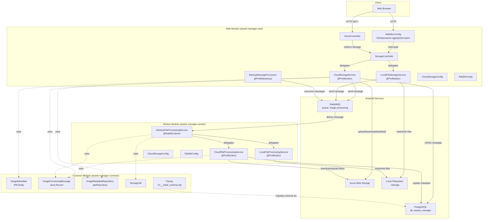
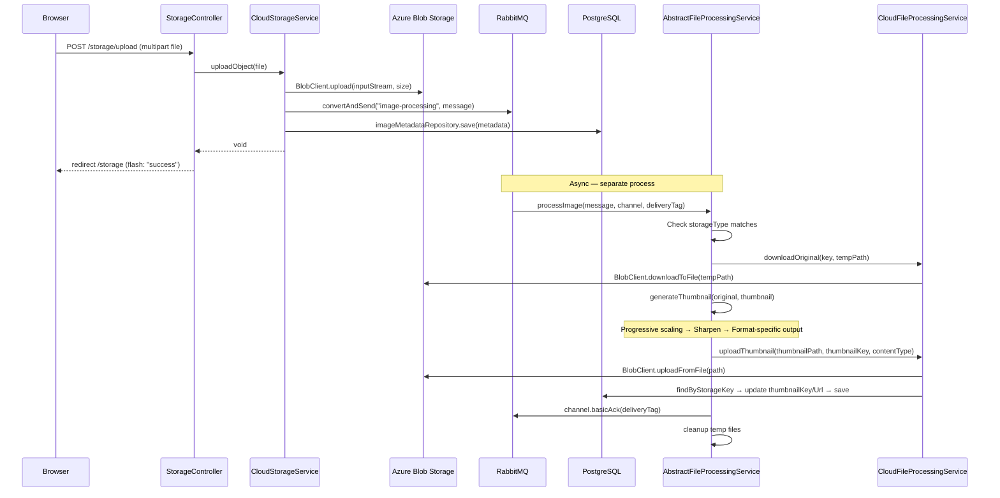
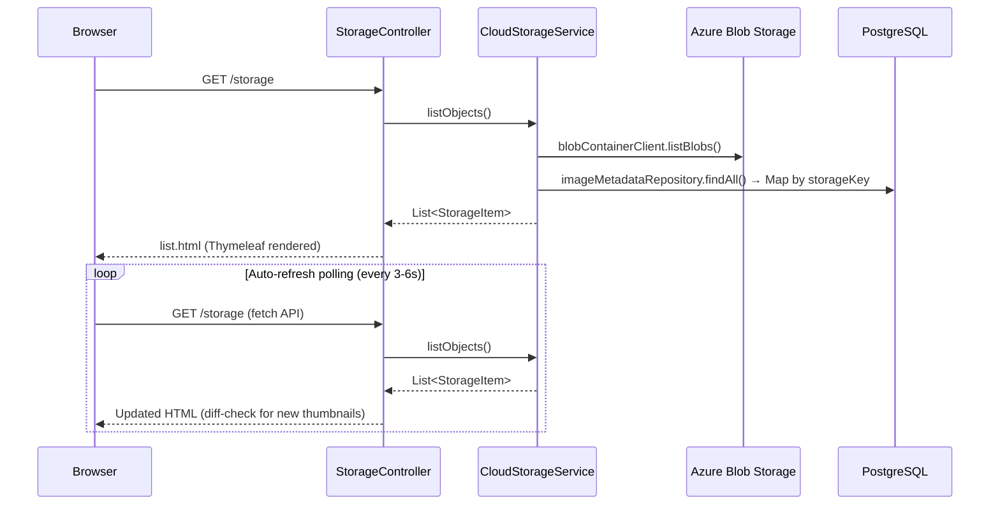
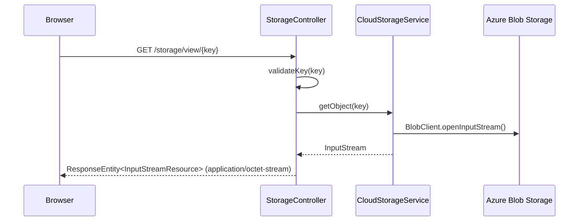
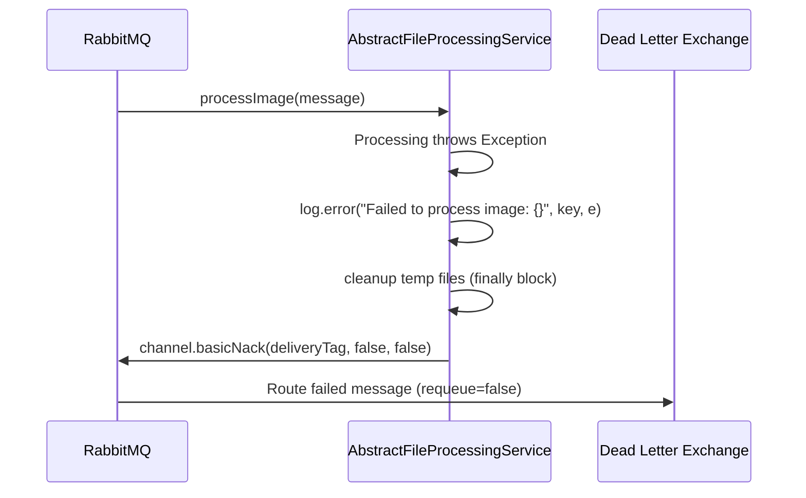

# Architecture Overview — Assets Manager

_Extracted on 2026-03-27. Documents the architecture as it exists in code._

## System Boundaries

The Assets Manager is a **multi-module Maven monorepo** containing three modules that produce two independently deployable Spring Boot applications plus one shared library:

| Module | Artifact | Type | Runtime | Entry Point | Port |
|--------|----------|------|---------|-------------|------|
| **common** | `assets-manager-common` | JAR (library) | N/A — dependency only | — | — |
| **web** | `assets-manager-web` | Spring Boot executable JAR | Java 21 (Temurin) | `AssetsManagerApplication.main()` | 8080 |
| **worker** | `assets-manager-worker` | Spring Boot executable JAR | Java 21 (Temurin) | `WorkerApplication.main()` | — (no HTTP) |

**Framework:** Spring Boot 3.4.4, Java 21 LTS, Maven 3.9.9

## High-Level Architecture

The system follows a **producer-consumer pattern** with two independent Spring Boot applications communicating asynchronously via a RabbitMQ message queue. The web module handles user-facing HTTP requests and storage operations. The worker module consumes image-processing messages and generates thumbnails. Both modules share domain models, the JPA repository, and utilities via the common module.

Storage backend selection is controlled by **Spring profiles**: the `dev` profile activates local filesystem implementations, while the default profile (`!dev`) activates Azure Blob Storage implementations. Both modules use the same profile-switching mechanism independently.

## Data Flow

### Primary Flow: Image Upload → Thumbnail Generation

### Secondary Flow: Image Gallery Browsing

### Tertiary Flow: Image Download / View

### Error Flow: Message Processing Failure

## Integration Points

| Type | Technology | Used By | Config Source | Protocol |
|------|-----------|---------|---------------|----------|
| Object Storage | Azure Blob Storage | `CloudStorageService` (web), `CloudFileProcessingService` (worker) | `azure.storage.connection-string` env var | HTTPS (Azure SDK) |
| Message Queue | RabbitMQ | `CloudStorageService` / `LocalFileStorageService` (producer), `AbstractFileProcessingService` (consumer), `BackupMessageProcessor` (monitor) | `spring.rabbitmq.*` env vars | AMQP 0.9.1 |
| Database | PostgreSQL 16 | `ImageMetadataRepository` via `CloudStorageService` (web), `CloudFileProcessingService` (worker) | `spring.datasource.*` env vars | JDBC |
| Local Storage | Filesystem (`../storage`) | `LocalFileStorageService` (web), `LocalFileProcessingService` (worker) | `local.storage.directory` property | File I/O (NIO.2) |
| Schema Migration | Flyway | `common` module (auto-run on startup) | `db/migration/V1__initial_schema.sql` | SQL over JDBC |
| API Documentation | Springdoc OpenAPI 2.8.6 | `StorageController` (web) | `springdoc.*` properties | HTTP (`/swagger-ui.html`, `/v3/api-docs`) |
| Frontend Framework | Bootstrap 5.3 | Thymeleaf templates (web) | CDN link in `layout.html` | HTTPS (CDN) |
| Image Processing | Java AWT + ImageIO | `AbstractFileProcessingService` (worker) | Hardcoded: max 600px, JPEG 0.95, PNG lossless | In-process |

## Architectural Patterns Observed

### Multi-Module Monorepo
Three Maven modules (`common`, `web`, `worker`) in a single repository. `common` is a shared library; `web` and `worker` are independent Spring Boot applications. Evidence: root `pom.xml` `<modules>` declaration; `common` listed as a `<dependency>` in both `web/pom.xml` and `worker/pom.xml`.

### Strategy Pattern (Storage Backend)
Web module: `StorageService` interface with `CloudStorageService` (`@Profile("!dev")`) and `LocalFileStorageService` (`@Profile("dev")`). Worker module: `FileProcessor` interface with `CloudFileProcessingService` (`@Profile("!dev")`) and `LocalFileProcessingService` (`@Profile("dev")`). Profile-based bean selection at startup — no runtime switching.

### Template Method Pattern (Worker Processing)
`AbstractFileProcessingService` defines the image processing pipeline (`processImage` → download → thumbnail → upload → ack). Subclasses implement storage-specific operations (`downloadOriginal`, `uploadThumbnail`, `generateUrl`, `getStorageType`). Evidence: `AbstractFileProcessingService` is abstract with concrete `processImage()` and abstract protected methods.

### MVC (Web Module)
Controllers (`HomeController`, `StorageController`) handle HTTP routing. Services (`CloudStorageService`, `LocalFileStorageService`) contain business logic. Views are Thymeleaf templates (`layout.html`, `list.html`, `upload.html`, `view.html`). Models are `StorageItem` (web DTO) and `ImageMetadata` (JPA entity from common). Evidence: `@Controller`, `@Service`, and `@Entity` annotations; templates in `resources/templates/`.

### Producer-Consumer (Asynchronous Processing)
Web module produces `ImageProcessingMessage` to the `image-processing` RabbitMQ queue after every upload. Worker module consumes messages via `@RabbitListener`. Manual acknowledgment mode with dead-letter routing on failure. Evidence: `RabbitTemplate.convertAndSend()` in services; `@RabbitListener(queues = IMAGE_PROCESSING_QUEUE)` in `AbstractFileProcessingService`; `AcknowledgeMode.MANUAL` in both `RabbitConfig` classes.

### Shared Kernel (Common Module)
Domain model (`ImageMetadata`, `ImageProcessingMessage`), repository (`ImageMetadataRepository`), utilities (`StorageUtil`), and schema migrations (`Flyway`) are centralized in `common`. Both `web` and `worker` depend on it. Evidence: `@EntityScan` and `@EnableJpaRepositories` pointing to `com.microsoft.migration.assets.common.*` in both application classes.

### Interceptor Chain (Cross-Cutting Logging)
`FileOperationLoggingInterceptor` (inner class of `WebMvcConfig`) intercepts all `/storage/**` requests (excluding `/storage/view/**`). Logs operation type, duration, and status. Evidence: `WebMvcConfigurer.addInterceptors()` with path patterns in `WebMvcConfig.java`.
